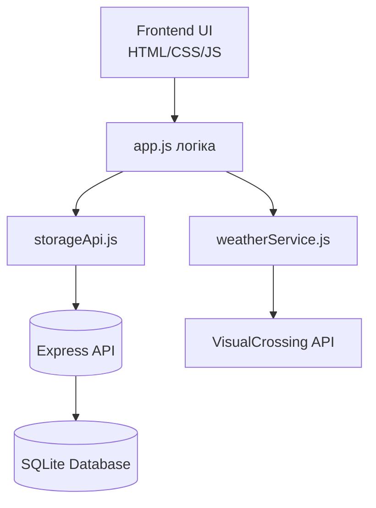
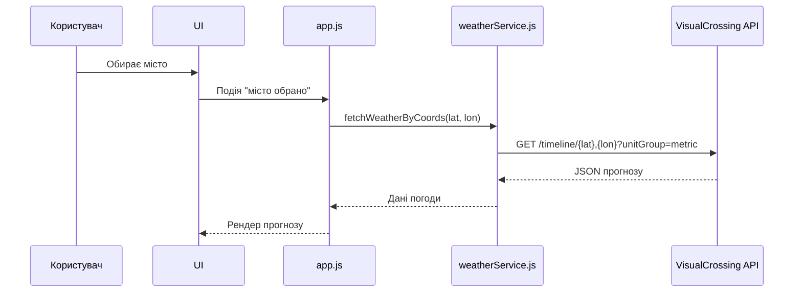
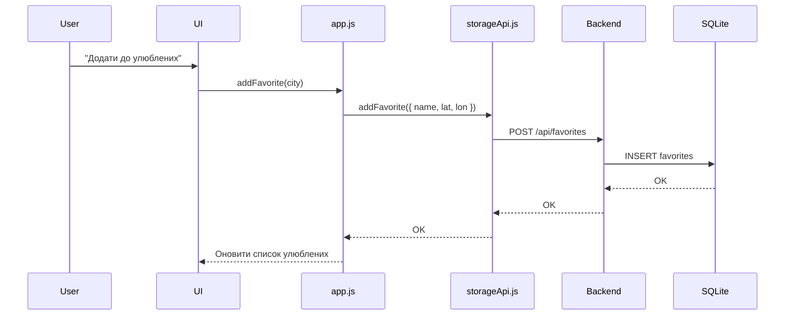
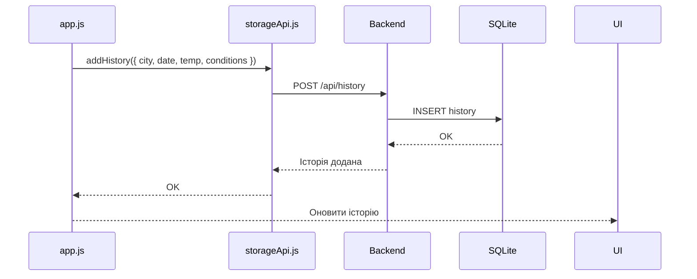

# Архітектура застосунку NodeWeather

## 1. Загальний огляд
NodeWeather — це клієнт–серверний застосунок для перегляду погоди, збереження улюблених міст та історії запитів. Складається з:

- **Frontend (HTML/CSS/JS)** — рендер UI, виклики API, обробка вибору країни/міста.
- **Backend (Node.js + Express)** — API для погоди, фаворитів, історії.
- **База даних SQLite** — зберігання favorites та history.
- **Інтеграція з VisualCrossing API** — прогноз погоди за координатами.

---

## 2. Компонентна діаграма (Mermaid)

---

## 3. Основні модулі

### 3.1 Frontend
- `app.js` — головна логіка UI
- `storageApi.js` — робота з `/api/favorites` і `/api/history`
- `weatherService.js` — отримання погоди з VisualCrossing
- `current.city.list.json` — великий файл міст (17+ МБ)

### 3.2 Backend
- `routes/favorites.route.js`
- `routes/history.route.js`
- `routes/weather.route.js`
- `db/db.js` — ініціалізація SQLite

---

## 4. Потоки даних (Data Flow)

### 4.1 Отримання прогнозу погоди

---

### 4.2 Додавання улюблених міст

---

### 4.3 Збереження історії

---

## 5. API

### 5.1 Favorites
- `GET /api/favorites`
- `POST /api/favorites`
- `DELETE /api/favorites/:id`

### 5.2 History
- `GET /api/history`
- `POST /api/history`
- `DELETE /api/history/:id`

### 5.3 Weather
- `GET /api/weather?lat=&lon=`

---

## 6. CI/CD
- GitHub Actions:
  - Встановлення залежностей
  - Запуск backend + frontend
  - Unit-тести (Jest)
  - E2E (Playwright)
  - Мутаційні тести (Stryker)

