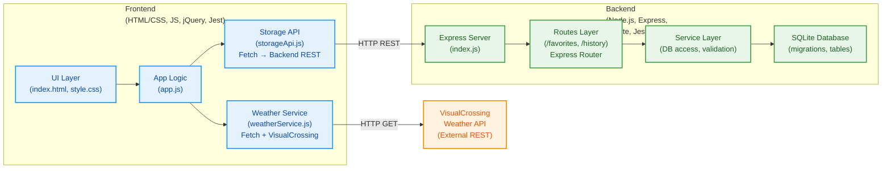
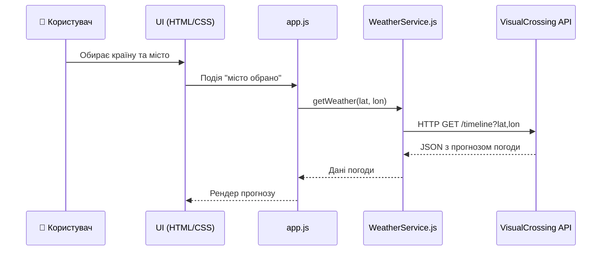
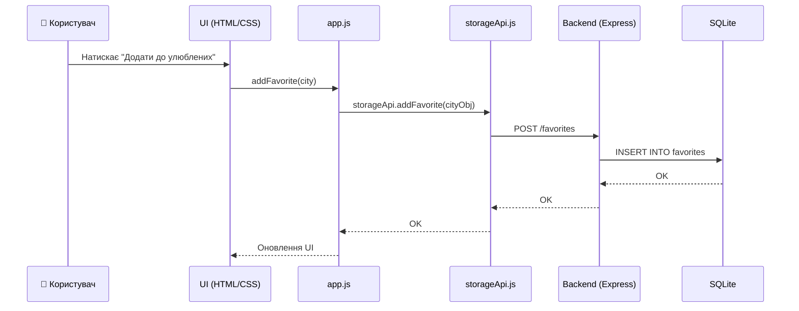
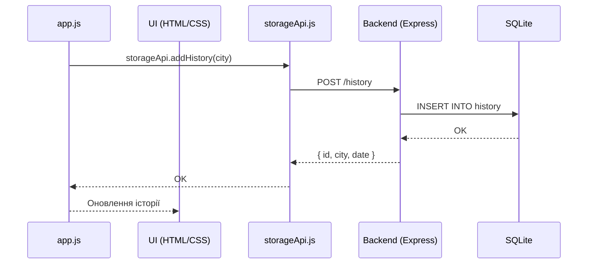

# Архітектура застосунку NodeWeather

Цей документ описує загальну архітектуру застосунку, основні компоненти системи, технології, що використовуються, та потоки даних між фронтендом, бекендом і зовнішніми сервісами.

---

## 1. Загальна структура репозиторію

Проєкт організовано у форматі монорепозиторію:

```
NodeWeather/
  frontend/   – UI, клієнтська логіка, сервіси, тести
  backend/    – Express-сервер, API-маршрути, робота з БД
  docs/       – документація (архітектура, модель даних тощо)
```

---

## 2. Стек технологій

### Frontend

- **HTML5, CSS3**
- **JavaScript (ES6+)**
- **jQuery**
- **Fetch API**
- **LocalStorage**
- **Jest**

### Backend

- **Node.js**
- **Express**
- **SQLite**
- **Міграції**
- **Jest / Supertest (опційно)**

### Зовнішні API

- **VisualCrossing Weather API**

---

## 3. Компонентна діаграма системи



---

## 4. Потоки даних (Data Flows)

### 4.1 Отримання прогнозу погоди



---

### 4.2 Додавання міста до улюблених



---

### 4.3 Додавання запису в історію



---

## 5. Висновок

Архітектура NodeWeather побудована за принципом розділення відповідальностей —  
фронтенд відповідає за UI, бекенд — за API та роботу з БД,  
а зовнішній сервіс постачає дані прогнозу погоди.
