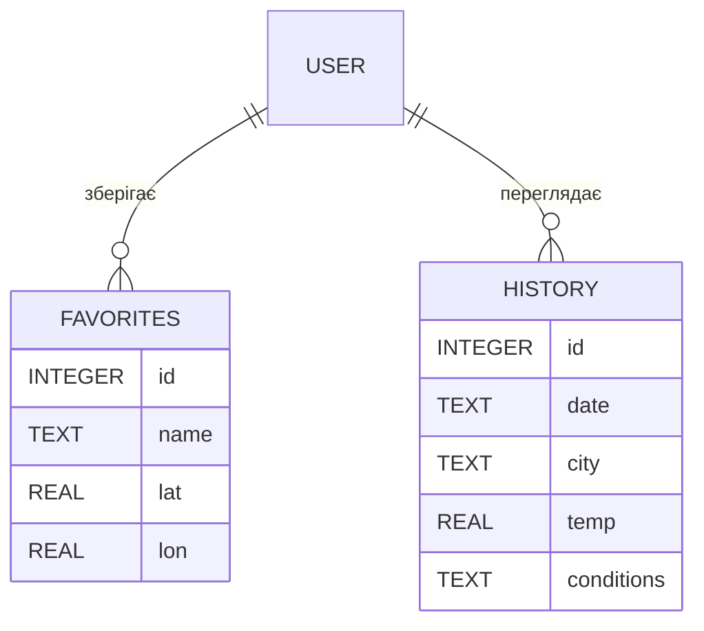

# Data Model — NodeWeather

## 1. Загальна концепція

Застосунок працює з трьома основними типами даних:

- **Міста** (вибір користувача)
- **Улюблені міста**
- **Історія переглядів**

---

## 2. Структура БД

### 2.1 Таблиця `favorites`

| Поле | Тип                               | Опис                     |
| ---- | --------------------------------- | ------------------------ |
| id   | INTEGER PRIMARY KEY AUTOINCREMENT | Унікальний ідентифікатор |
| name | TEXT                              | Назва міста              |
| lat  | REAL                              | Географічна широта       |
| lon  | REAL                              | Географічна довгота      |

---

### 2.2 Таблиця `history`

| Поле       | Тип                               | Опис                                 |
| ---------- | --------------------------------- | ------------------------------------ |
| id         | INTEGER PRIMARY KEY AUTOINCREMENT | Унікальний ідентифікатор             |
| date       | TEXT                              | Дата/час запиту (ISO 8601)           |
| city       | TEXT                              | Назва міста                          |
| temp       | REAL                              | Температура на момент запиту         |
| conditions | TEXT                              | Погодні умови (Cloudy, Clear, Snow…) |

---

## 3. ER-діаграма



---

## 4. JSON-схеми

### 4.1 Об’єкт “місто”

```json
{
  "name": "Kyiv",
  "lat": 50.4501,
  "lon": 30.5234
}
```

### 4.2 Об’єкт “історія”

```json
{
  "city": "Kyiv",
  "date": "2025-02-12T10:23:54.000Z",
  "temp": 3.5,
  "conditions": "Cloudy"
}
```

---

## 5. Логіка оновлення даних

### Додавання до Favorites

1. Користувач тисне “додати”
2. UI викликає `storageApi.addFavorite()`
3. Backend додає запис у SQLite
4. Frontend оновлює список

### Додавання History

1. Після отримання погоди frontend формує `{ city, date, temp, conditions }`
2. Відправляє POST /api/history
3. SQLite додає запис
4. UI оновлює історію

---

## 6. Відповідність вимогам ЛР2

- Дані описані
- Зв’язки побудовані
- ER-діаграма присутня
- Оновлення/агрегація описані
